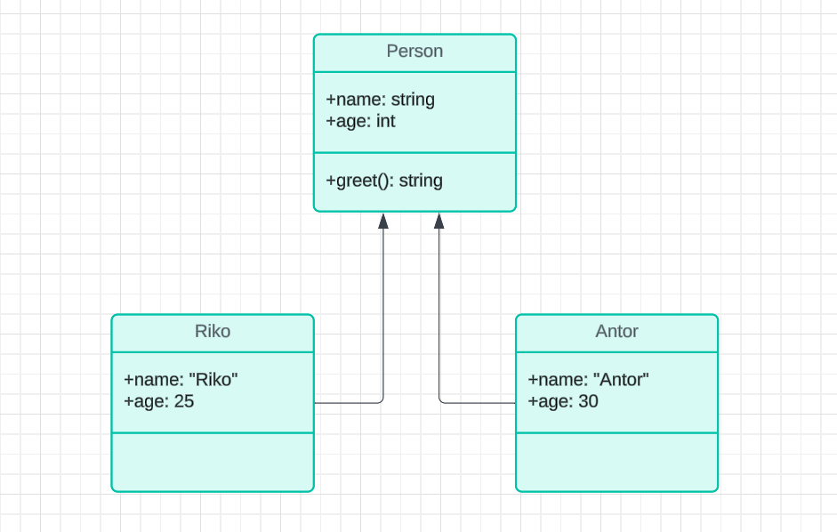
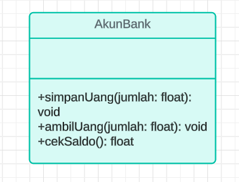

# Praktikum 3
# Pemrograman Berorientasi Objek


### Latihan 1

• Apa yang harus didefinisikan sebeum membuat objek? <br>

Sebelum membuat objek dalam pemrograman berbasis objek 
(Object-Oriented Programming, OOP), hal yang harus didefinisikan 
terlebih dahulu : <br>
#### Kelas (Class) <br>
Sebelum membuat objek, pertama-tama Anda harus mendefinisikan 
kelas. Kelas adalah blueprint atau template yang digunakan untuk 
membuat objek. Kelas mendefinisikan atribut (properties) dan metode 
(fungsi atau perilaku) yang akan dimiliki oleh objek. Misalnya, jika 
Anda membuat objek Mobil, Anda perlu mendefinisikan kelas Mobil 
yang memiliki atribut seperti warna, model, dan metode seperti 
menjalankan atau berhenti. <br>

• Buatlah gambar diagram class dan dua buah objek dari class Person
bernama Antor dan Riko <br> <br>
 <br>


• Buatlah gambar diagram objek AkunBank dengan instance method
simpanUang, ambilUang dan cekSaldo <br> <br>
 <br>

<br>

### Latihan 2

Buatlah kode program java untuk : <br>
• Mendeklarasikan class Person, dengan atribut Nama,
JenisKelamin, Umur 

``` java
class Person {
    String Nama;
    String JenisKelamin;
    int Umur;

    // Konstruktor untuk kelas Person
    Person(String Nama, String JenisKelamin, int Umur) {
        this.Nama = Nama;
        this.JenisKelamin = JenisKelamin;
        this.Umur = Umur;
    }

    // Method untuk menampilkan informasi Person
    void tampilkanInfo() {
        System.out.println("Nama: " + Nama);
        System.out.println("Jenis Kelamin: " + JenisKelamin);
        System.out.println("Umur: " + Umur + " tahun");
    }
}
```
<br>
• Buatlah dua buah objek dari class Person bernama Anton
dan Riko 

``` java
    public static void main(String[] args) {
        // Membuat dua objek dari class Person: Anton dan Riko
        Person anton = new Person("Anton", "Laki-laki", 30);
        Person riko = new Person("Riko", "Laki-laki", 25);

        // Menampilkan informasi Anton
        System.out.println("Informasi Anton:");
        anton.tampilkanInfo();

        // Menampilkan informasi Riko
        System.out.println("\nInformasi Riko:");
        riko.tampilkanInfo();
    }
```

### Latihan 3

Buatlah kode java untuk : <br>
• Mendeklarasikan class AkunBank dengan instance method
simpanUang, ambilUang dan cekSaldo 

```java
class AkunBank {
    int saldo;

    // Konstruktor untuk menetapkan saldo awal
    AkunBank(int saldoAwal) {
        saldo = saldoAwal;
    }

    // Method untuk menyimpan uang
    void simpanUang(int jumlah) {
        saldo += jumlah;
        System.out.println("Simpan uang: Rp. " + jumlah);
    }

    // Method untuk mengambil uang
    void ambilUang(int jumlah) {
        saldo -= jumlah;
        System.out.println("Ambil uang: Rp. " + jumlah);
    }

    // Method untuk menampilkan saldo saat ini
    void tampilkanSaldo() {
        System.out.println("Saldo saat ini: Rp. " + saldo);
    }
}
```
<br>

• Buat objek AkunBank dan tetapkan nilai saldo awal Rp. 100000,
kemudian panggil 3 method tersebut dan tampilkan proses berikut : <br>

```
Selamat Datang di Bank ABC
Saldo saat ini: Rp. 100000
Simpan uang: Rp. 500000
Saldo saat ini: Rp. 600000
Ambil uang: Rp. 150000
Saldo saat ini: Rp. 450000
```

``` java
    public static void main(String[] args) {
        // Membuat objek AkunBank dengan saldo awal Rp. 100000
        AkunBank akun = new AkunBank(100000);

        // Menampilkan sambutan dan saldo awal
        System.out.println("Selamat Datang di Bank ABC");
        akun.tampilkanSaldo();

        // Menyimpan uang sebesar Rp. 500000
        akun.simpanUang(500000);
        akun.tampilkanSaldo();

        // Mengambil uang sebesar Rp. 150000
        akun.ambilUang(150000);
        akun.tampilkanSaldo();
    }
```
